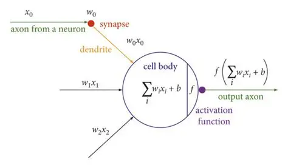

## Roadmap

- [ ] Micrograd
- [ ] Backpropagation
- [ ] MLP
- [ ] Makemore Part 1
- [ ] Makemore Part 2
- [ ] Makemore Part 3
- [ ] GPT

# DAY 1 (29-05-2026)

Started with micrograd, understood basic derivatives, slope and what do they represent intuitively. Started working with micrograd and writing my own code for it. 

Initialized the main data structure i.e. Value class and added children, op and basic operator overloading to it.

## Key Learnings

- Derivatives measure how sensitive an output is to changes in an input.
- Slope represents the local rate of change at a point.
- Neural networks can be represented as computational graphs made of simple mathematical operations.
- Every node must keep track of how it was created to enable backpropagation later.

# DAY 2 (30-05-2026)

Understood backpropagation and how gradients are calculated and passed backward. Also implemented it on a simple neuron. Experimented and played with the Value class members and visualized how gradients affect the forward pass.

## Key Learnings

- Chain rule:- dx/dz= dx/dy * dy/dz i.e. if x and y are dependent directly and y and z are dependent then we can find how x changes with z through chain rule
- Basic structure of a neuron, the input is multiplied by some weight and then a bias is added to it and further it is passed through an activation function

- A single neuron structure:- 
    

        
    

# DAY 3 (1-06-2026)

Understood the implementation part of backpropagation, topological sort and handled two bugs. Also started to learn the neuron and layer class and started implementing it. Also compared our micrograd with PyTorch's inbuilt MLP.

## Key Learnings

- Implemented backpropagation and cross checked the gradients manually, also made grad and backward members in the Value class
- Also fixed the code as it was not considering multivariate chain rule case i.e. if there are multiple variables for the calculation of a single gradient, the gradients accumulate
- Learnt about topological sort and how it is used to automate backpropagation instead of redundantly calling the _backward() function again and again
    

    <a href="https://www.geeksforgeeks.org/dsa/topological-sorting/">
        Topological Sort Reference
    </a>

- Added many other arithmetic functions to our Value class like __rmul__, __neg__, __pow__, __exp__ and defined the gradients for each of them also handled the case when our value class element is being multiplied by a constant
- Made the neuron class which defines a single neuron with weights and bias initially randomized bw -1 and 1 and then using __call__ member the activation function is defined and returned thereafter.

# DAY 4 (4-06-2026)

Understood the neuron layer and MLP class intuitively and also implemented it. Learnt about how losses are calculated and what do they signify, also initialized a small dataset and calculated loss for it.

## Key Learnings

- Implemented neuron, layers and MLP class and also initialized and tested variables of it.
- <b>Loss</b>:- Loss is a single number that defines how well the model is performing. It does so by calculating the offset of the predicted values with the expected ones. In micrograd we used <b>Mean squared errors</b> to calculate loss. There are other types of loss functions too, We can refer them here:- 
    

    <a href="https://www.geeksforgeeks.org/machine-learning/ml-common-loss-functions/">
        Loss Functions
    </a>
    

- Initialized a small dataset and calculated the loss for it using our neuron, layers and MLP class.

# DAY 5 (5-06-2026)

Implemented gradient descent and understood it intuitively, compared our model to PyTorch's inbuilt one and completed the video.

## Key Learnings

- Now as we got our loss, we can tell that the lower the loss the closer the predicted values are to the expected ones. This tells us that the lower the loss, the better the model. So, we need to minimize loss. In micrograd we used, gradient descent
- <b>Gradient Descent</b>:- It is a method of minimizing loss, we take a really small learning rate(which is a random floating point number usually 0.01 to 0.05) and nudge the values in accordance to the parameter's gradient
   
  <i>parameters.data += -learning_rate * parameters.gradient</i>
- <b>Q.) Why do we take such a small learning step and how do we decide the learning rate</b>
   
  If the learning rate is too low, Then it will take too much time to optimize loss. Whereas, if it is too high, then it gets unstable and we overstep.
   
    Gradient descent follows the local slope and converges to a minimum depending on the loss landscape and initialization. It is not guaranteed to find the global minimum.

    

- In micrograd we did gradient descent in one go for the whole dataset, usually in real world scenarios this becomes very time consuming and costly. So different types of gradient descents are used which you can refer here:- 
        

        <a href="https://medium.com/@morepravin1989/understanding-gradient-descent-and-its-types-with-mathematical-formulation-and-example-5c505555140c">
            Types of Gradient Descent
        </a>
        

- <b>IMPORTANT RULE</b>:- Don't forget to reset the gradients to 0 again before backpropagating.
